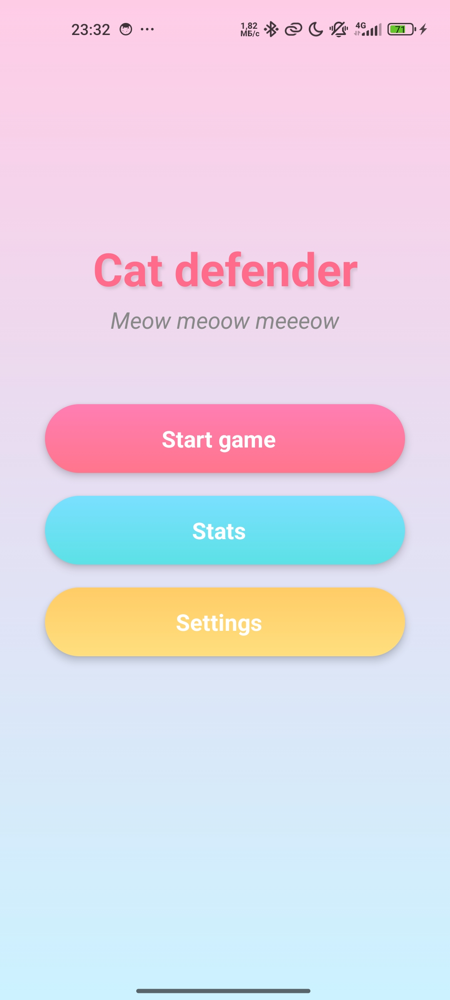
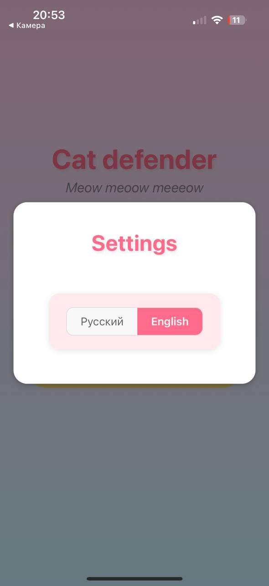
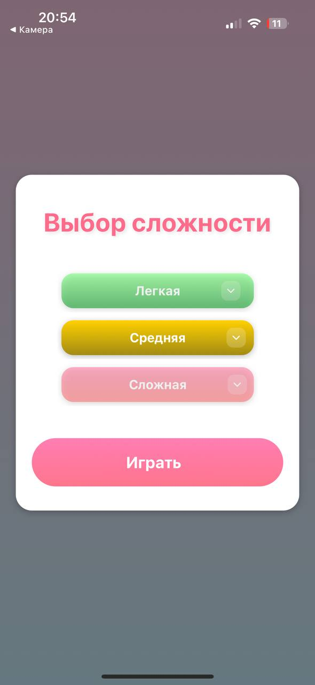
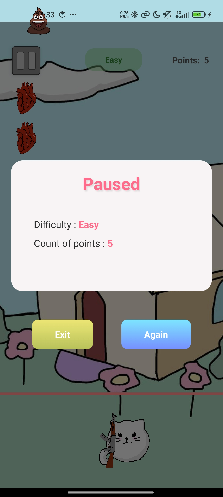
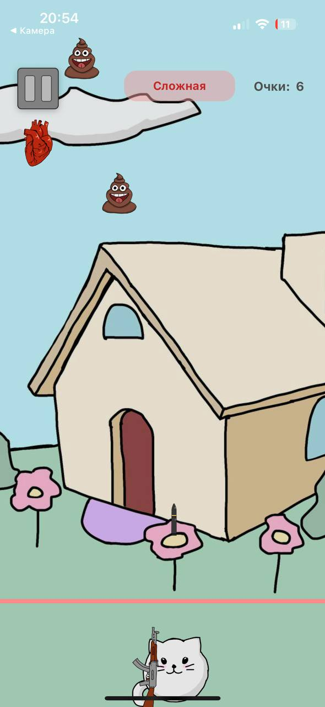
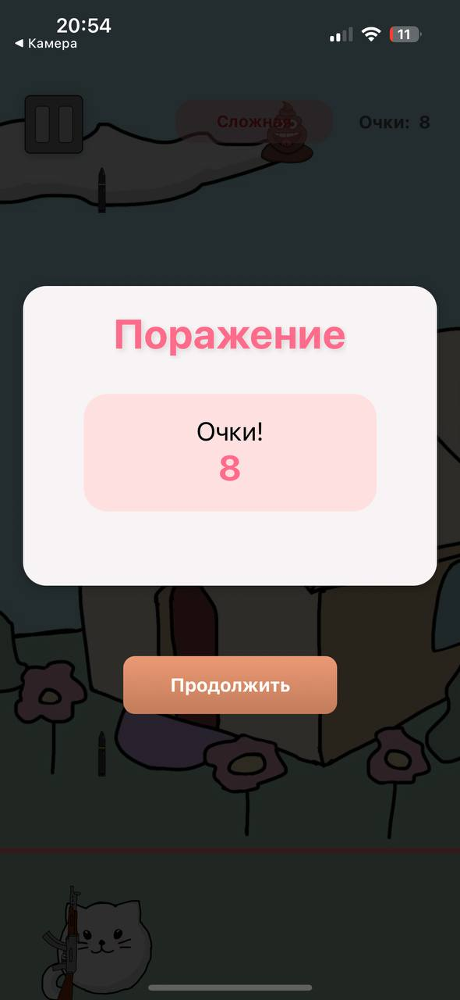

# Cat Defender - Мобильная игра

Пушистый котик с автоматом защищается от врагов!
## Демо

### Меню
<div style="display: flex; gap: 10px;">
   
   
   
</div>

### Гемплей

<div style="display: flex; gap: 10px;">
   
   
   
</div>


## Технологии

- React Native
- Expo
- TypeScript
- React Navigation
- react-native-game-engine
- Zustand

## Установка и запуск для разработчиков

### Предварительные требования

1. Установите Node.js 
2. Установите Git
3. Установите приложение Expo Go на телефон:


### Запуск проекта  

1. Клонируйте репозиторий:
   ```bash
   git clone  https://github.com/Froxick/cat-defender-game.git
   cd название-репозитория
2. Установите зависимости:
    ```bash
    npm install
3. Запустите проект
    ```bash
    npx expo start
